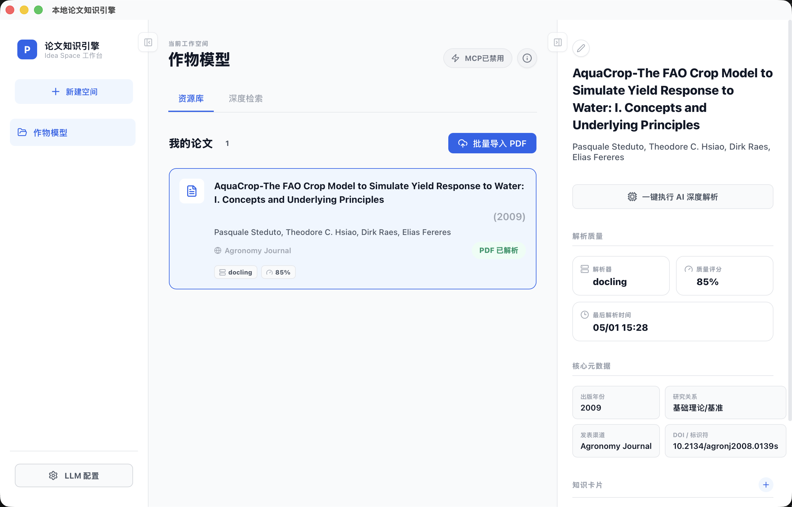
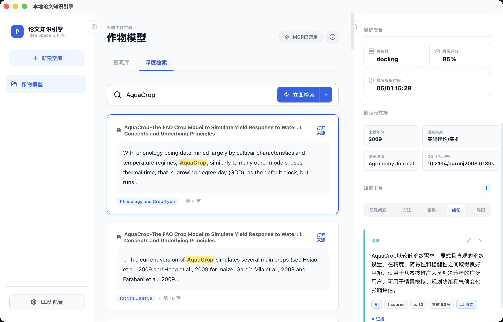

<h1 align="center">Local Paper Knowledge Engine</h1>

<p align="center">
  本地论文知识库
  <br />
  通过AI将论文拆解，并提供MCP接口，便于基于知识库进行研究开展
</p>

<p align="center">
  <a href="LICENSE"></a>
  
  
  
  
  
</p>

<p align="center">
  <a href="README.md">English</a> | <a href="README.zh-CN.md">简体中文</a>
</p>

Local Paper Knowledge Engine 是一个本地优先的桌面应用，用来把论文 PDF
变成可检索、可溯源、可被 AI 理解的研究知识库。它支持按研究主题划分空间，
把 PDF 解析成段落，建立本地检索索引，生成中文论文理解，沉淀稳定的知识卡片，
并通过 MCP Server 把当前工作空间开放给 Claude Code、Codex、Cursor 等外部
Agent 使用。

> 状态：活跃早期版本。核心本地工作流、桌面打包、AI 解析、检索和 MCP 访问
> 已经实现，并有测试覆盖。

## 功能

- 研究空间：按主题或项目隔离论文与知识。
- PDF论文 批量导入、向量化和AI解析知识卡片。
- 检索：支持 FTS和语义检索。
- PDF 原文查看：方便核对知识卡片对应的原文证据。
- MCP Server：让外部编码/研究 Agent 读取当前活动研究空间内容和知识卡片。

## 界面截图





## 架构

```text
React/Vite UI
    |
Tauri desktop shell
    |
FastAPI sidecar  ---- SQLite + local PDF files
    |
background worker sidecar
    |-- PDF parsing
    |-- embeddings
    |-- AI paper understanding
    |
MCP stdio server
```


## 环境要求

- Python 3.11 或更高版本。
- Node.js 和 npm。
- 如果要运行或打包 Tauri 桌面应用，需要 Rust/Cargo。

## 安装

```bash
python3.11 -m venv .venv
source .venv/bin/activate
pip install -e ".[dev,pdf-advanced]"

npm install
npm --prefix frontend install
```

也可以使用 Makefile：

```bash
make install
make frontend-install
npm install
```

## 启动 Tauri 桌面应用

```bash
source .venv/bin/activate
make tauri-dev
```


## 构建

macOS 桌面安装包：

```bash
source .venv/bin/activate
make package-macos
```

构建产物位于：

```text
src-tauri/target/release/bundle/
```

更多说明见：[docs/packaging.md](docs/packaging.md)。

## MCP Server

启动 MCP Server：

```bash
paper-engine-mcp
```

如果要连接 macOS 打包应用的数据目录：

```bash
PAPER_ENGINE_DATA_DIR="$HOME/Library/Application Support/com.local.paperknowledgeengine" paper-engine-mcp
```

MCP 客户端配置示例：

```json
{
  "mcpServers": {
    "paper-knowledge-engine": {
      "command": "/path/to/paper-engine-mcp"
    }
  }
}
```

MCP 访问默认关闭。连接外部 Agent 前，需要先在应用里开启 Agent Access。
MCP 工具只暴露当前 active idea space，不会跨空间读取数据。


## 许可证

MIT License。详见 [LICENSE](LICENSE)。
